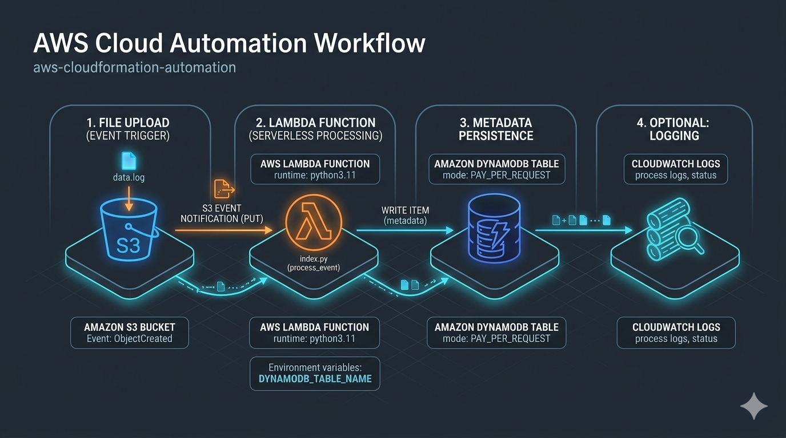

# AWS CloudFormation Automation

Este repositório contém um laboratório prático focado na **automação de infraestrutura e arquitetura serverless orientada a eventos** na AWS. O objetivo principal é demonstrar o processamento automatizado de arquivos carregados no Amazon S3, utilizando gatilhos assíncronos com AWS Lambda e persistência de metadados no Amazon DynamoDB.

Para garantir um ciclo de desenvolvimento ágil e sem custos, toda a infraestrutura foi simulada localmente utilizando o **LocalStack**. O provisionamento definitivo foi documentado via **CloudFormation (Infrastructure as Code)**.

---

## 🏗️ Arquitetura do Fluxo de Dados

O fluxo de processamento segue uma arquitetura baseada em eventos (EDA), garantindo desacoplamento e escalabilidade:



1. **File Upload:** Um arquivo de log ou dados é enviado para o bucket do Amazon S3.
2. **S3 Event Notification:** O S3 identifica o upload (`s3:ObjectCreated:*`) e dispara um gatilho assíncrono para a Lambda.
3. **Serverless Processing:** A função AWS Lambda (escrita em Python) é acordada, extrai os metadados do arquivo (nome, tamanho e tipo) utilizando o SDK `boto3`.
4. **Metadata Persistence:** A Lambda realiza uma operação de escrita (`PutItem`) no banco de dados NoSQL (Amazon DynamoDB).
5. **CloudWatch Logs:** Todo o ciclo de execução gera logs detalhados para auditoria e monitoramento.

---

## 🛠️ Tecnologias e Ferramentas Utilizadas

*   **AWS Lambda:** Execução de lógica backend em ambiente serverless.
*   **Amazon S3:** Armazenamento de objetos e origens de eventos.
*   **Amazon DynamoDB:** Banco de dados NoSQL de alta performance para logs de processamento.
*   **AWS CloudFormation:** Definição e provisionamento de infraestrutura como código (IaC).
*   **LocalStack:** Emulação local dos serviços AWS para testes isolados e seguros.
*   **Python 3.11 & Boto3:** Linguagem de programação e SDK oficial da AWS.
*   **Docker & Docker Compose:** Gerenciamento do container do LocalStack.

---

## 📂 Estrutura de Diretórios

```text
├── infra/
│   ├── cloudformation.yaml   # Template IaC para provisionamento na nuvem AWS
│   └── docker-compose.yml    # Configuração do ambiente local do LocalStack
├── scripts/
│   ├── setup-localstack.sh   # Automação de deploy dos recursos locais e zip da Lambda
│   └── upload-test.sh        # Script de simulação de upload e consulta ao DynamoDB
├── src/
│   ├── lambda_function.py    # Código-fonte Python com a lógica do manipulador (Handler)
│   └── requirements.txt      # Dependências de desenvolvimento
├── assets/
│   └── diagram.png           # Imagem explicativa do workflow técnico
├── .gitignore                # Restrições de envio de lixo de build e chaves locais
└── README.md                 # Documentação principal do projeto

```
## 🚀 Como Executar e Testar o Projeto Localmente
### Pré-requisitos
 * Docker e Docker Compose instalados.
 * AWS CLI configurado (pode ser com credenciais fictícias para o LocalStack).
 * Python 3.11+ (opcional, para visualização de tipagem local).
### Passo 1: Iniciar o LocalStack
Navegue até a pasta de infraestrutura e suba o container do ambiente virtual da AWS:
```bash
cd infra
docker-compose up -d

```
### Passo 2: Instalar dependências de desenvolvimento (Opcional)
Caso queira analisar o código localmente na sua IDE sem alertas de erro:
```bash
pip install -r ../src/requirements.txt

```
### Passo 3: Provisionar a Infraestrutura Local
Acesse a pasta de scripts, conceda permissão de execução e execute o inicializador. Este script irá compactar a Lambda, criar a tabela do DynamoDB, o bucket S3 e configurar as notificações de gatilho de forma 100% automatizada:
```bash
cd ../scripts
chmod +x *.sh
./setup-localstack.sh

```
### Passo 4: Executar o Teste de Ponta a Ponta
Para validar se o fluxo está funcionando, execute o script de teste. Ele cria um arquivo txt temporário, faz o upload para o S3 local, aguarda o processamento e realiza um scan na tabela do DynamoDB para validar se o registro foi salvo:
```bash
./upload-test.sh

```
## 🧠 Insights e Aprendizados Adquiridos
 * **Desenvolvimento Híbrido:** O código da Lambda foi estruturado para identificar dinamicamente se está rodando no LocalStack ou na AWS real através de variáveis de ambiente (LOCALSTACK_ENDPOINT). Isso viabiliza uma esteira de CI/CD limpa.
 * **Infraestrutura como Código (IaC):** O mapeamento minucioso via CloudFormation reduz o erro humano e garante a reprodutibilidade exata do ambiente de desenvolvimento para produção.
 * **Gestão de Recursos Serverless:** Compreensão prática sobre o ciclo de vida de funções efêmeras (Cold Start vs Warm Start) ao instanciar os clientes do SDK boto3 fora do método manipulador (lambda_handler).
